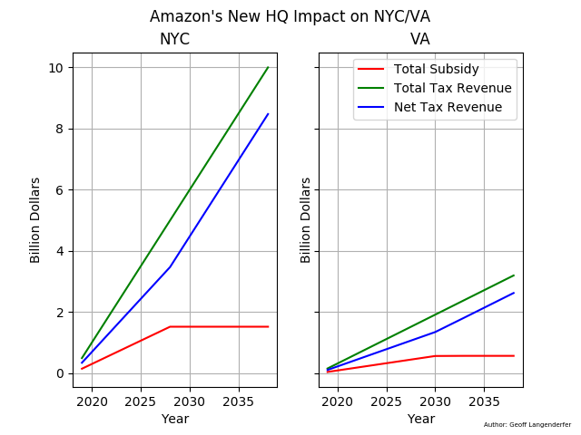

# Amazon Tax Revenue Impact on NYC and VA

Amazon will be building a new HQ spread between NYC, VA, and Nashville. 
I was interested to know how this would benefit these areas, so I used the info
Amazon provided in a blog post and assumed a linear realization of the projected 
tax revenue and subsidy. 
    
[Amazon HQ2 Blog Post](https://blog.aboutamazon.com/company-news/amazon-selects-new-york-city-and-northern-virginia-for-new-headquarters)

If you wish to use this code, feel free. But, please give me an attribution. 
